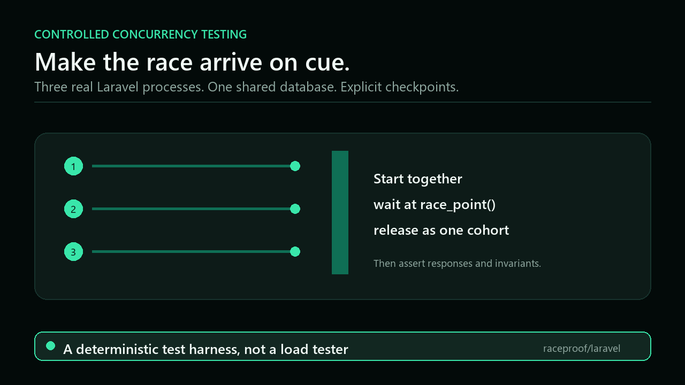
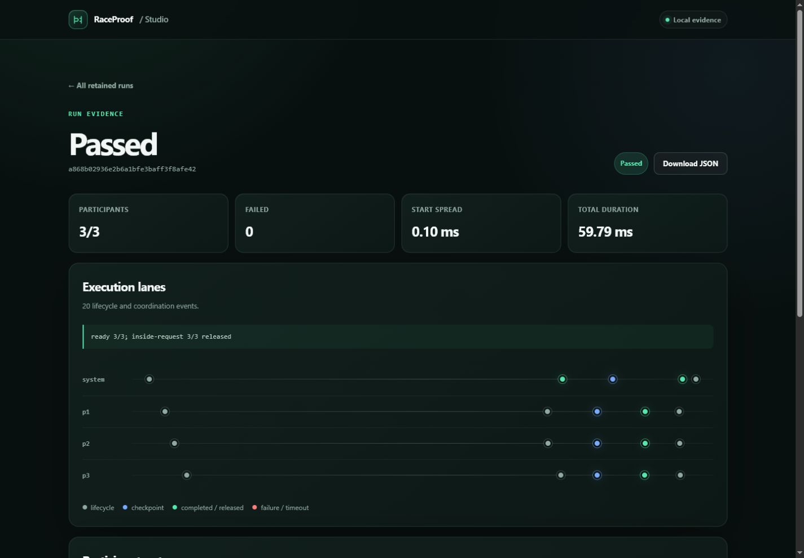

<p align="center">
  
</p>

# RaceProof for Laravel

<p>
  <a href="https://github.com/zerodycoder/RaceProof/actions/workflows/tests.yml"></a>
  
  
  <a href="LICENSE"></a>
</p>

**Make race conditions arrive on cue - then keep the fix under test.**

RaceProof coordinates independent Laravel processes against the same database,
pauses them at explicit application checkpoints, releases them as one cohort,
and gives you a single result for response and database assertions.

It is built for the failures that ordinary feature tests rarely reproduce:
overselling the final unit, redeeming one coupon twice, losing wallet updates,
accepting an expired quote, uniqueness races, deadlocks, and lock timeouts.

> **Release status:** the v1 API candidate and release pipeline are implemented,
> but no package has been published to Packagist yet. The install commands below
> become available with the first beta. Contributors can use a source checkout
> today.

## See the failure, then prove the fix

<p align="center">
  
</p>

This animation summarizes the repository's
[executable three-process overselling fixture](tests/Integration/OversellingDemoTest.php):
the broken path creates three orders from stock `1` and ends at `-2`; the atomic
claim creates one order, ends at `0`, and returns two honest `409` responses.
MySQL and PostgreSQL evidence exercise the same broken/fixed route pair.

## The smallest useful test

Application code marks the critical point:

```php
race_point('oversell-claim');

$created = DB::transaction(function () use ($product): bool {
    $claimed = Product::query()
        ->whereKey($product->getKey())
        ->where('stock', '>', 0)
        ->decrement('stock');

    if ($claimed === 0) {
        return false;
    }

    Order::query()->create(['product_id' => $product->getKey()]);

    return true;
});

abort_unless($created, 409);
```

The test starts real application processes, waits until all of them reach that
point, and releases them together:

```php
use function RaceProof\Laravel\race;

$result = race()
    ->participants(3)
    ->postJson('/api/checkout', ['product_id' => $product->getKey()])
    ->releaseWhenAllReach('oversell-claim')
    ->run();

$result
    ->assertAllFinished()
    ->assertNoWorkerFailures()
    ->assertStatusCount(201, 1)
    ->assertStatusCount(409, 2)
    ->assertNoServerErrors()
    ->assertInvariant(
        fn () => Order::query()->count() === 1
            && $product->fresh()->stock === 0,
        'Exactly one order may claim the final unit.',
    );
```

For a copy-ready broken-to-fixed walkthrough, use the
[five-minute guide](docs/five-minute-guide.md).

## Install

Once the first beta is published:

```bash
composer require raceproof/runtime:^0.1
composer require raceproof/laravel --dev

php artisan vendor:publish --tag=raceproof-config
php artisan raceproof:doctor
```

Install `raceproof/runtime` only when application code contains
`race_point()` calls. It is a framework-free production dependency whose
checkpoint calls are no-ops unless a validated RaceProof worker activates an
in-memory handler. It has no process runner, filesystem, network, command, or
Laravel integration.

Before the beta, develop from source:

```bash
git clone https://github.com/zerodycoder/RaceProof.git
cd RaceProof
composer install
composer check
```

See [runtime checkpoint deployment](docs/runtime-checkpoints.md) before adding
instrumentation to production code.

## How it works

1. The parent test validates the environment, database, request, participant
   overrides, authentication specs, and checkpoint plan.
2. RaceProof boots independent Laravel worker processes against the same
   configured database.
3. A start barrier coordinates request entry; `race_point()` can rendezvous
   workers inside the application.
4. The parent releases a checkpoint only after the complete cohort arrives.
5. The result combines responses, worker failures, timeouts, redacted
   diagnostics, and a versioned event timeline for assertions and CI reports.

The operating system and database still decide execution order after release.
RaceProof controls the important rendezvous; it does not claim exact schedule
replay or formal proof that no other race exists.

## Participant-specific requests and authentication

Each participant can override payload, headers, cookies, bearer tokens,
session identity, Sanctum credentials, and trusted bootstrap data:

```php
use RaceProof\Laravel\ParticipantBuilder;

$result = race()
    ->participants(2)
    ->postJson('/api/transfer', ['amount' => 100])
    ->actingAs($owner, 'web')
    ->forParticipant('p2', fn (ParticipantBuilder $participant) => $participant
        ->withPayload(['amount' => 75])
        ->withHeaders(['X-Tenant' => 'north'])
        ->withToken($sanctumToken)
        ->actingAs($reviewer)
        ->withBootstrap(TransferBootstrap::class, ['tenant' => 'north']))
    ->releaseWhenAllReach('balance-read')
    ->run();
```

All participant specs are validated before orchestration and cross the process
boundary as JSON - never serialized closures. Read the
[request and authentication guide](docs/participant-specs.md) and
[bootstrap guide](docs/participant-bootstrap.md) for merge rules and security
boundaries.

## Assertions and evidence

```php
$result->assertAllFinished();
$result->assertNoWorkerFailures();
$result->assertNoServerErrors();
$result->assertNoTimeouts();
$result->assertStatusCount(201, 1);
$result->assertExactlySuccessful(1);
$result->assertStartSpreadBelow(10);
$result->assertInvariant(fn () => true, 'Invariant failed.');

$result->successful();
$result->failed();
$result->statuses();
$result->participant('p2');
$result->startSpreadMs();
$result->durationMs();
$result->failureReport();
```

Human, JSON, and JUnit reporters all use one versioned, bounded, redacted report
model. See [evidence reporters](docs/reporters.md) for CI examples and the JSON
v1 contract.

## RaceProof Studio

Studio is an optional, local evidence viewer. It visualizes retained runs,
participant outcomes, timing, checkpoint lanes, warnings, and bounded response
evidence without moving execution or assertions out of Pest/PHPUnit.

<p align="center">
  
</p>

Enable it explicitly in a local or testing environment:

```dotenv
RACEPROOF_STUDIO_ENABLED=true
```

```bash
php artisan make:race-test InventoryOversell /api/checkout --participants=3
php artisan test --filter=InventoryOversellTest
php artisan raceproof:reports
php artisan raceproof:studio
```

Open `/raceproof` on the application's normal local development server. Studio
is server-rendered and requires no Node/Vite setup. It never registers routes,
reads archives, or writes reports in production, even if its flag is
misconfigured. The dashboard is deliberately not an arbitrary endpoint runner:
the committed test remains the reproducible source of truth.

Read the [Studio guide](docs/studio.md) for configuration, retention, CLI, and
security details.

## Safety model

RaceProof fails closed:

- production is always refused;
- tests must explicitly enable RaceProof;
- non-`testing` environments need a separate explicit opt-in;
- open parent database transactions and SQLite in-memory are rejected;
- an exact database-name allowlist can be required in CI;
- captured bodies and headers are bounded and sensitive data is redacted;
- run, participant, and checkpoint identifiers are path-safe;
- coordination uses JSON only, with no untrusted `unserialize()`;
- crash and timeout artifacts are retained for diagnosis.

Use a dedicated disposable database. Do not combine multi-process tests with
transaction-based test traits: workers cannot see the parent's uncommitted
records. The [production safety guide](docs/production-safety.md) and
[database guide](docs/database-testing.md) contain the full operating contract.

## Support matrix

| Dimension | Support |
| --- | --- |
| PHP | 8.2+ |
| Laravel | 12 and 13 |
| Databases | MySQL 8.4 and PostgreSQL 17 continuously verified |
| Linux | CI reference platform |
| WSL2 | Primary development target |
| macOS | Best-effort |
| Native Windows | Experimental |
| SQLite | File-backed smoke tests only; not production lock evidence |

The exact compatibility promise is maintained in
[the platform matrix](docs/platform-support.md).

## Examples

- [Overselling the final unit](examples/overselling/README.md)
- [Redeeming one coupon twice](examples/coupon-redemption/README.md)
- [Concurrent wallet debits](examples/wallet-debit/README.md)
- [Quote acceptance races](examples/quote-acceptance/README.md)

All published examples are wired into executable tests; they are not
standalone documentation snippets.

## Documentation

Start with the [documentation map](docs/README.md), or jump directly to:

- [Five-minute guide](docs/five-minute-guide.md)
- [Architecture](docs/architecture.md)
- [PHPUnit and Pest workflows](docs/testing-workflows.md)
- [Troubleshooting](docs/troubleshooting.md)
- [Public API contract](docs/public-api.md)
- [Versioning and upgrades](docs/versioning.md)
- [Release runbook](docs/releasing.md)
- [Known limitations](docs/known-limitations.md)

## Project status

The code, API guard, deterministic archives, supply-chain checks, database
evidence, and release automation are implemented. Public package publication
and real beta-adoption evidence remain honest external gates; stable release is
blocked until they are complete.

See the [roadmap](ROADMAP.md), [pre-release audit](docs/release-audit.md), and
[beta evidence](docs/beta-evidence.md) for the machine-checked status.

## Contributing

Focused issues and pull requests are welcome. Before opening one, read
[CONTRIBUTING.md](CONTRIBUTING.md), the [quality policy](docs/quality.md), and
the [code of conduct](CODE_OF_CONDUCT.md).

For security reports, follow [SECURITY.md](SECURITY.md). Do not disclose a
vulnerability in a public issue.

## License

RaceProof is open source under the [MIT License](LICENSE). You may use, modify,
distribute, sublicense, and sell copies, including commercially. Copies or
substantial portions must keep the copyright and permission notice. The
software is provided without warranty. See the
[plain-language licensing guide](docs/licensing.md) for contribution and
redistribution notes.
